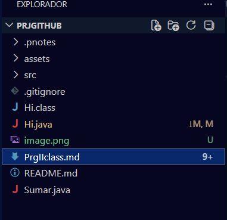

Dilan Toapanta 
Cuaderno de apuntes


# Class I: Git

##Primer prg-Java
- ls: lista de archivos
- pwd: muestra donde estoy
- exit: salir de la terminal


- java(nombre del archivo): para ejecutar/compilar
- ctrl d: busca texto parecido al seleccionado
  
```java
public class Hi {
    public static void main(String[] args) {
        System.out.println("Hola, Hermano!")
        System.out.println("¿Cómo estás?");
    }
}

##Segundo prg-Sumar
```java
public class Sumar {
    public static void main(String[] args) {
        int num1 = 5;
        int num2 = 10;
        int sum= num1+num2;
        System.out.println("La suma de " + num1 + " y " + num2 + " es: " + sum);
    }
}
```
# Class II: github

## Comandos linux

- cd c:
- java --version
- code readme.md
- history
- history >> readme.md

## cmd-git
(1 vez)
- git init : una vez por proyecto 
- git clone:traer un proyecto de la nube
- .gitignore: 
  
  cada día 
-git stash: guarda cambios actuales sin un commit formal
- git status:estado de los archivos 
- git add(nombre de archivo)/.: respaldo de archivos
- git commite-m "Creacion del proyecto": guardar achivo
- git push: enviar a la nube
 - git pull: traer los cambios de la nube e integrar
  
git clone: clona un directorio 

**Imagen**

  

**Terminal del git personalizada**


|Problem                    |Solución                   |
|---------------------------|---------------------------|
|'.class' y '.pdf' se suben |Usar '*.class' y '.pdf'    |
|Git los sigue subiendo     |                           |

Link 
[Youtube](https://www.youtube.com/watch?v=mLwwyCKZZdk&list=RDmLwwyCKZZdk&start_radio=1)
